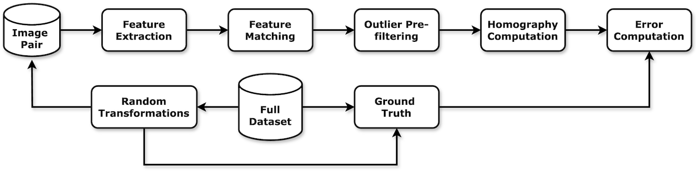

# Stabilo Optimize

[](https://github.com/rfonod/stabilo-optimize/releases) [](https://www.python.org/) [](https://github.com/rfonod/stabilo-optimize/blob/main/LICENSE) [](https://github.com/rfonod/stabilo-optimize) [](https://doi.org/10.1016/j.trc.2025.105205) [](https://arxiv.org/abs/2411.02136) [](https://doi.org/10.5281/zenodo.13828430)

**Stabilo-Optimize** is a Python benchmarking tool designed specifically to evaluate and tune methods and hyperparameters of the [Stabilo](https://github.com/rfonod/stabilo) 🚀 library for video and track stabilization tasks. It systematically generates performance evaluations through random perturbations, eliminating the need for ground-truth homographies. This tool significantly simplifies the optimization of stabilization techniques, making it ideal for high-precision tasks in fields such as urban monitoring, traffic analysis, and drone imagery processing.


## Key Features

- **Ground Truth-Free Benchmarking**: Randomly generates photometric and homographic perturbations (brightness variations, Gaussian blur, saturation adjustments, fog effects, rotations, translations, scales, and perspective shifts).
- **Hierarchical Benchmarking Strategy**: Encourages users to systematically vary hyperparameters hierarchically for efficient parameter optimization.
- **Flexible JSON Configuration**: Customize extensive parameter settings using nested dictionaries (see [comprehensive_benchmark.json](experiments/sample_experiment/comprehensive_benchmark.json) or [simple_benchmark.json](experiments/sample_experiment/simple_benchmark.json) for examples).
- **Result Visualization**: Generates comprehensive performance plots and benchmarking process visualizations.



## Installation

1. **Create and activate a Python virtual environment** (Python >= 3.9), e.g., using [Miniconda3](https://www.anaconda.com/docs/getting-started/miniconda/install):

    ```bash
    conda create -n stabilo-optimize python=3.9 -y
    conda activate stabilo-optimize
    ```

2. **Clone or fork the repository**:

    ```bash
    git clone https://github.com/rfonod/stabilo-optimize.git
    cd stabilo-optimize
    ```

3. **Install dependencies**:

    ```bash
    pip install -r requirements.txt
    ```

## Example Usage

A sample benchmark (`simple_benchmark.json`) with provided scenes and vehicle bounding box masks is included in the `experiments/sample_experiment` directory. To reproduce the results, run:

```bash
python benchmark.py experiments/sample_experiment/simple_benchmark.json -sp -sv -o
```

- `-sp`: Save performance plots.
- `-sv`: Save benchmark visualization video.
- `-o`: Overwrite previous results.

Use `python benchmark.py --help` to explore additional command-line options.

**Note:** This example is limited to three scenes for demonstration purposes. Users should define their own benchmarks with a more representative selection of scenes for meaningful evaluation.

## Custom Benchmarking

To set up your own benchmark, create a new experiment directory within `experiments` containing:

- `benchmark.json`: Configuration specifying methods/hyperparameters and number of random trials (`N`) per scene. For reliable results, set `N > 100`.
- `scenes`: Directory containing input images (and optional exclusion masks in YOLO format). Ensure selected scenes adequately represent your stabilization tasks. To obtain reliable benchmarking results, include a diverse set of scenes covering different lighting conditions and camera  viewpoints.

Example structure:

```text
experiments
└─custom_experiment
  ├─benchmark.json
  └─scenes
    ├ image1.jpg
    ├ image1.txt
    ├ image2.jpg
    ├ image2.txt
    ├ ...
```

**Note**: A comprehensive configuration file (`comprehensive_benchmark.json`) is included for illustration purposes. Due to computational costs, users should avoid directly running such an extensive parameter search. Instead, adopt a hierarchical parameter search approach by fixing some hyperparameters and varying others.

Refer to the [Stabilo](https://github.com/rfonod/stabilo) 🚀 library and the associated [article](https://doi.org/10.1016/j.trc.2025.105205) for detailed descriptions of available methods and hyperparameters.

## Benchmarking Metrics

Benchmarks use metrics like Homography Estimation Accuracy (HEA) and Mean Intersection over Union (MIoU). MIoU specifically evaluates the accuracy of object-level registration and requires bounding box masks for calculation. Detailed metric definitions and analysis are provided in the manuscript.

## Citing This Work

If you use **Stabilo-Optimize** in your research, software, or product, please cite the following resources appropriately:

1. **Preferred Citation:** Please cite the associated article for any use of the Stabilo-Optimize, including research, applications, and derivative work:

    ```bibtex
    @article{fonod2025advanced,
      title = {Advanced computer vision for extracting georeferenced vehicle trajectories from drone imagery},
      author = {Fonod, Robert and Cho, Haechan and Yeo, Hwasoo and Geroliminis, Nikolas},
      journal = {Transportation Research Part C: Emerging Technologies},
      volume = {178},
      pages = {105205},
      year = {2025},
      publisher = {Elsevier},
      doi = {10.1016/j.trc.2025.105205},
      url = {https://doi.org/10.1016/j.trc.2025.105205}
    }
    ```

2. **Repository Citation:** If you reference, modify, or build upon the Stabilo-Optimize software itself, please also cite the corresponding Zenodo release:

    ```bibtex
    @software{fonod2025stabilo-optimize,
      author = {Fonod, Robert},
      license = {MIT},
      month = mar,
      title = {Stabilo Optimize: A Framework for Comprehensive Evaluation and Analysis for the Stabilo Library},
      url = {https://github.com/rfonod/stabilo-optimize},
      doi = {10.5281/zenodo.13828430},
      version = {1.0.0},
      year = {2025}
    }
    ```

## Contributing

Contributions from the community are welcome! If you encounter any issues or have suggestions for improvements, please open a [GitHub Issue](https://github.com/rfonod/stabilo-optimize/issues) or submit a pull request.

## License

This project is distributed under the MIT License. See the [LICENSE](LICENSE) file for more details.
